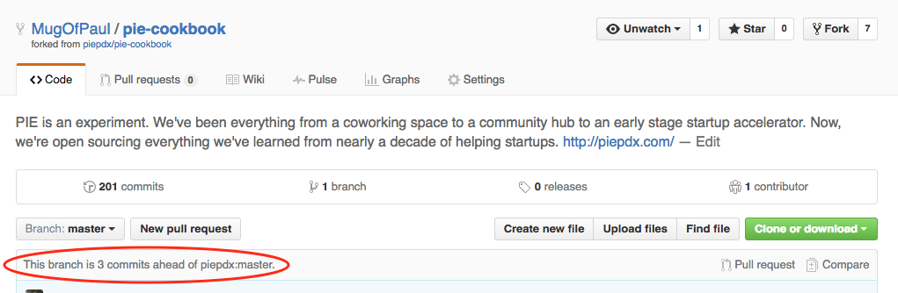
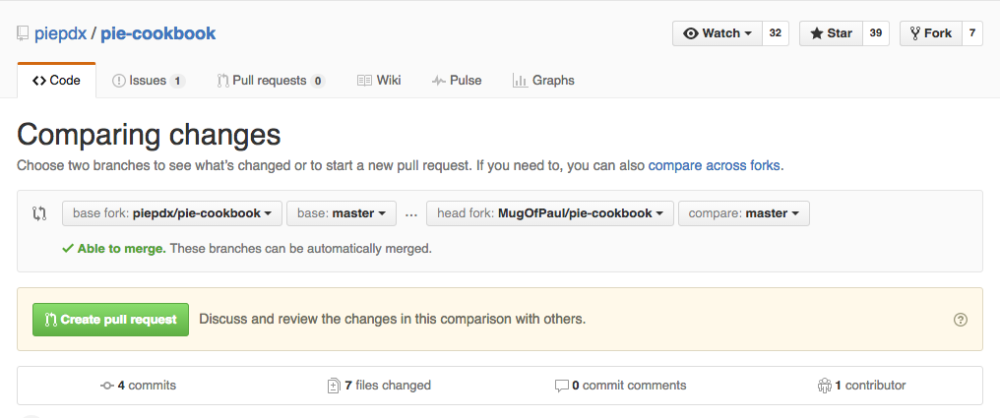
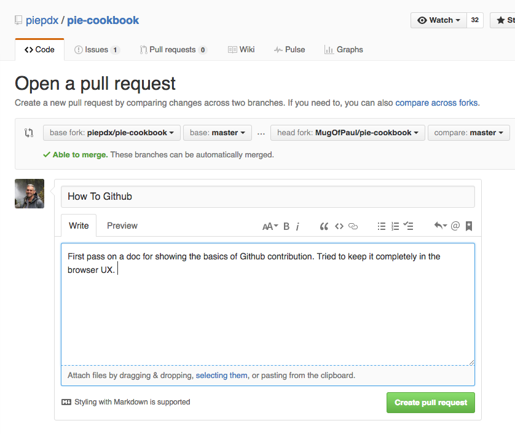
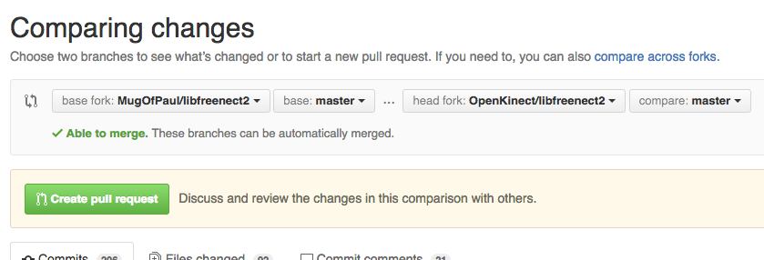
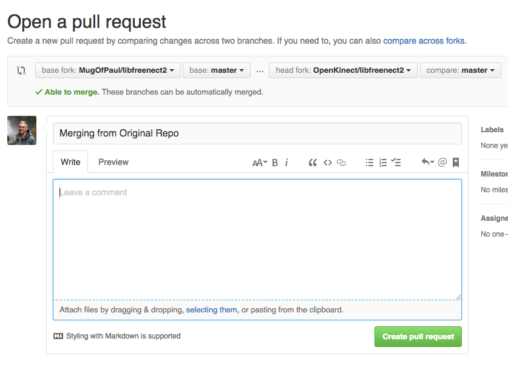
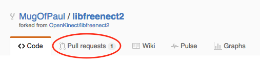
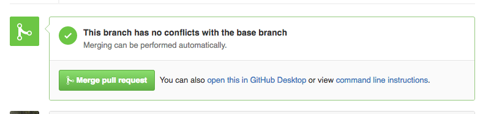

# How To Github

## Initial Setup
### Create your Github Account
First thing you will need to do is create an account on Github. [You can do that here](https://github.com/join).

### Fork the Pie Cookbook Repo
Before you can PIE, you need a fork! Repositories (or "repos") are nothing more than a collection of files and folders that multiple people can add, edit, or delete from. To ensure these changes are tracked and controlled, a revision history is kept. The most orderly way for several people to contribute to the same repo is with Forks and Pull Requests. A fork is nothing more than a copy of the original repo. Once you make a fork, you can make changes without disturbing anyone. 

Here's what it looks like when user MugOfPaul creates a Fork of the piepdx/pie-cookbook repo:

Once you have successfully forked the repo, you will now have a copy of the original under your account. Notice that GitHub knows this new repo is linked to the original. This is how the magic of Pull Requests happen.

## Creating/Editing
With your initial setup complete, you can now start contributing! Github is extremely flexible on how you can do this. For more complex software projects, there's all kinds of ways to edit files and generally shoot yourself in the foot. The good news is the Pie Cookbook is all text so you can actually entirely contribute using the Github provided web interfaces.

The text that the Cookbook is using is called Markdown. This is a way of giving structure and formatting to text that isn't dependent on any particular editing tool. It's also much simpler to use than HTML. Thankfully Github has some really great reference on Markdown. [I'd recommend starting here](https://help.github.com/articles/basic-writing-and-formatting-syntax/). 

### Creating New Files via Browser
Let's say you'd like to start a whole new file full of wonderful thoughts. You'll want to make sure you are creating the file in the correct/appropriate location. Also since it will be a Markdown file, the name of the file should end in `.md` When you are done with the initial edits, you need to commit your changes. This is the same as saving your file. It's nice to put some context of the work done in the comments section. Remember, all of this work stays in your Fork until you issue a Pull Request. 

_Unfortunately, creating new directories isn't quite this easy. Unless someone knows of a trick that I don't?_

### Editing Existing Files via Browser
So let's say you want to edit an existing file. The process is very similar to creating a file.

## Contributing Your Work
Let's say at this point, you've done some work but it only exists within your Fork of the repo. Github is clever enough to know how much different your Fork is from the original repo. 

### Creating a Pull Request into Original Repo
Then when you are ready for your changes to be incorporated into the original repo so other people can see it, you make a Pull Request. This is simply asking the maintainers of the original repo to review your work and consider merging it into the original repo that you forked from. If they accept the request and merge it in, it will be available for all the other contributors to see. 

To get started, while looking at your Fork of the repo, you can click the Pull Request link.

There's also a Pull Request button that may appear.

This will take you to a page where you can review the actual Pull Request. Notice how it's now on the original repo page. This is because you are submitting a Pull Request for the orginal repo to pull from your forked repo.

Finally you can click the button to open the pull request.

The maintainers that are reviewing your request may have questions or comments. The Github interface allows for discussion on a particular Pull Request for this reason. 

## Stay Up to Date
It's a good idea to keep your Fork updated to the latest and greatest version of the original repo. This is how you can get all of the new work done by other collaborators. If your Fork becomes too out of date, you can run into merge conflicts. If you have conflicts, Github won't let you create a Pull Request until they are resolved. Sometimes this is as easy as updating your repo. 

### Pull Request into _Your_ Fork
This is one of those things that is actually easier if you're using the command line interface or a desktop tool. But in the spirit of these instructions using just the online interface, here's how you can do it.

If you'll recall in the Creating a Pull Request section, Github will show you how many commits ahead your forked repo is of the original repo. If your repo is out of date, it will also show you how many commits _behind_ your fork is compared to the original. **These instructions only work if you are showing that your fork is behind**

You will click the Pull Request button or link just like when you are wanting to merge from your fork to the original repo. If you are only behind and not ahead on commits, you'll get a message that says there isn't anything to compare and a link will be provided to let you switch the base. 

When you switch the base, you are doing the reverse of a normal Pull Request. Which means you are pulling the latest work in the original repo into your fork. Now create the Pull Request. 

Remember you are basically sending a Pull Request to yourself here.

Once created, _your fork_ will show an outstanding Pull Request. 

Click to review the Pull Request. Scroll all the way to the bottom of the page and you will see the option to merge the work into your repo. 

Accept the merge and now if your fork should be up to date with the latest and greatest!

